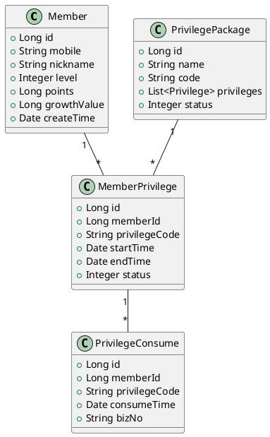

# ARK会员中心设计方案

## 一、业务背景
会员体系是企业经营的核心资产，通过会员体系可以:
- 提升用户粘性和活跃度
- 沉淀用户数据，实现精准营销
- 通过会员权益变现，提升商业价值

## 二、核心能力
1. 会员账户
   - 会员注册与登录
   - 会员资料管理
   - 会员等级体系
   - 会员积分体系
   - 会员成长值体系

2. 会员权益
   - 权益包配置管理
   - 权益发放与消费
   - 权益到期管理
   - 权益使用记录

3. 会员营销
   - 会员任务系统
   - 会员活动系统
   - 会员积分商城
   - 会员专享价

4. 会员分析
   - 会员画像
   - 会员行为分析
   - 会员价值分析
   - 会员流失预警

## 三、系统架构

### 1. 模块划分

```plantuml
@startuml
package "ark-center-member" {
    [会员账户模块] as account
    [会员权益模块] as privilege  
    [会员营销模块] as marketing
    [会员分析模块] as analysis
}

database "MySQL"
database "Redis" 
queue "Message Queue"

account --> MySQL
account --> Redis
privilege --> MySQL 
privilege --> Redis
marketing --> MySQL
marketing --> Message Queue
analysis --> MySQL
@enduml
```

### 2. 核心领域模型



## 四、关键技术方案

### 1. 会员等级体系
- 采用成长值模式，通过用户行为积累成长值
- 成长值达到阈值自动升级，定期任务检查降级
- 不同等级对应不同权益包
- 使用Redis缓存会员等级信息

### 2. 会员积分系统
- 积分收入来源:购物、签到、活动等
- 积分支出:兑换商品、抵扣等
- 采用积分流水记录所有变动
- 使用分布式锁保证积分操作原子性

### 3. 权益发放与消费
- 权益统一配置，支持多种权益类型
- 权益包按会员等级自动发放
- 权益消费需要验证有效性
- 支持权益到期自动失效

### 4. 会员数据分析
- 实时计算会员指标
- 离线分析会员画像
- 基于用户行为建立会员价值模型
- 通过规则引擎实现精准营销

## 五、安全考虑
1. 会员信息安全
   - 敏感信息加密存储
   - 分级权限控制
   - 操作审计日志

2. 接口安全
   - 统一认证鉴权
   - 接口限流
   - 数据脱敏

## 六、扩展性设计
1. 支持水平扩展
   - 无状态服务设计
   - 分库分表预留
   - 缓存集群部署

2. 业务可扩展
   - 插件化权益系统
   - 可配置的等级体系
   - 灵活的营销规则

## 七、监控运维
1. 监控指标
   - 核心接口RT
   - 业务异常监控
   - 会员关键指标

2. 运维保障
   - 容灾备份
   - 降级熔断
   - 灰度发布 